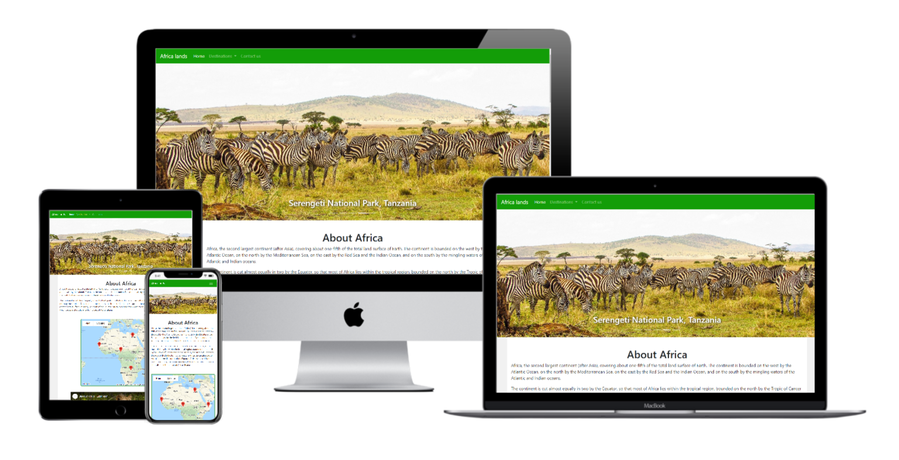
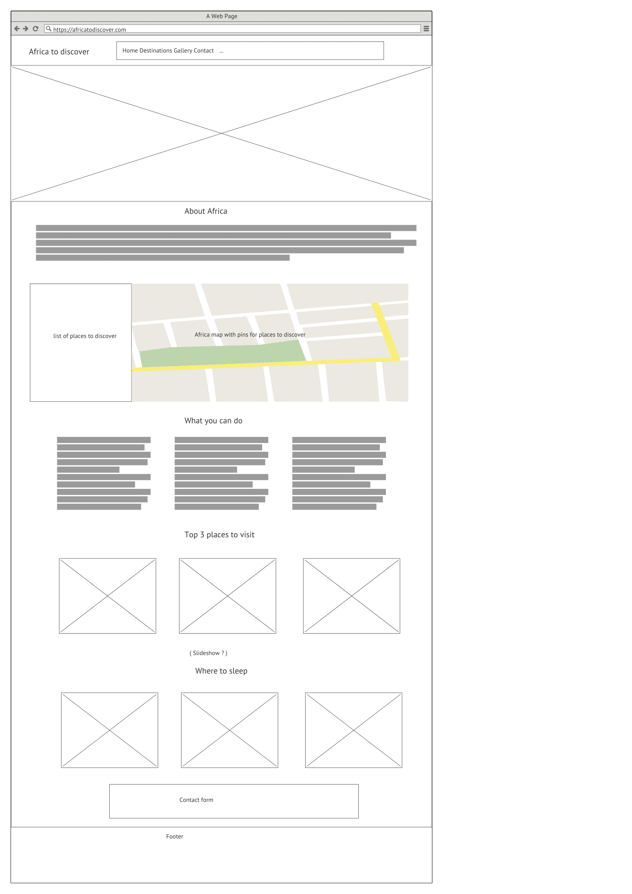
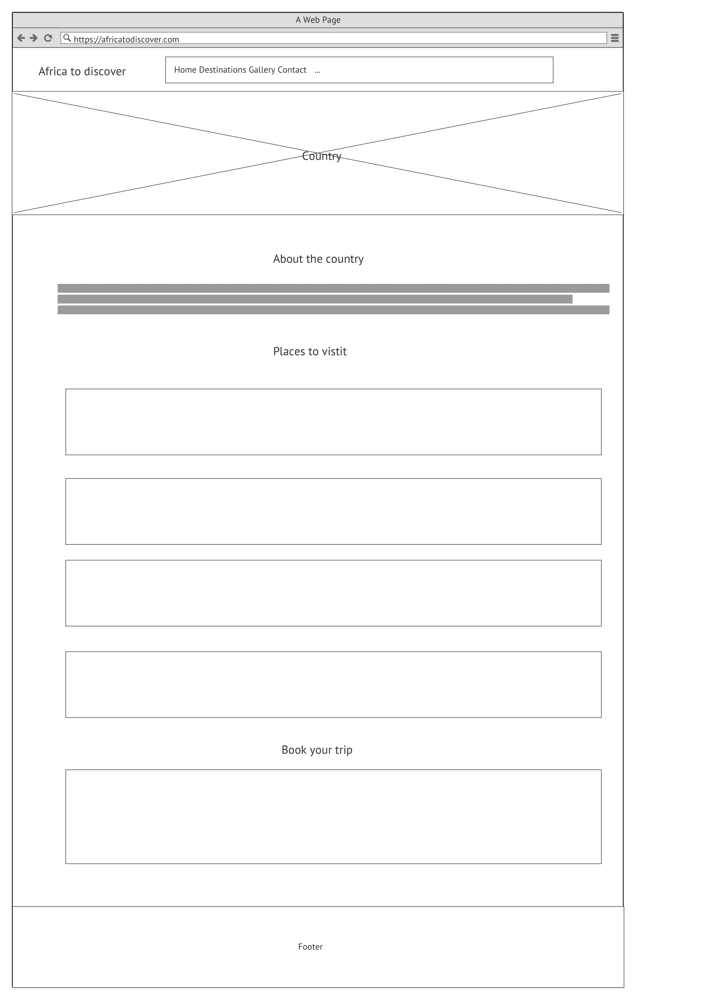
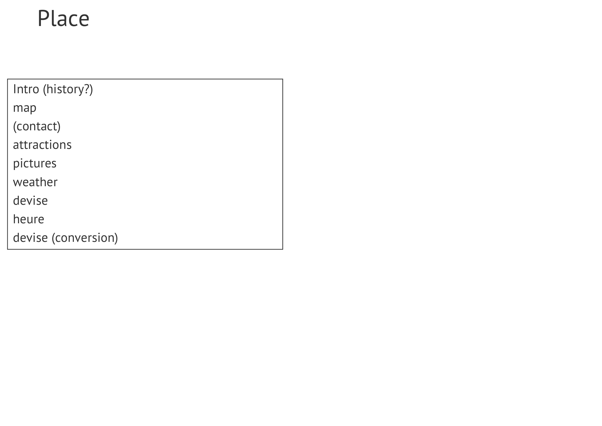

<h1 align="center">Africa Lands</h1>

[Click here to view the live project.](https://hervembarga.github.io/milestoneproject2-interactiveFrontEnd/)

This is a fictional interactive website where people can discover Africa beauty and diversity by selecting a country or a place to learn about.
APIs are used to render some information and images the users see and the design is responsive
and accessible on different devices which makes it user friendly.

<h2 align="center"></h2>

## User Experience (UX)

### User stories

#### First Time Visitor Goals

1. I want to easily understand the main purpose of the site.
2. I want to find information about african countries.
3. I want to be able to contact the site owner.

#### Returning Visitor Goals

1. I want to know where to go.
2. I want to know what to do there.
3. I want to know where to sleep and where to eat.

#### Frequent User Goals
1. I want to be able to learn about new countries to discover.
2. I want to check any new feature.

### Business Strategy

1. Connect people to Africa.
2. Find partners to provide some services to visitors like flights, Hotels, restaurants...
3. Get feedback from visitors or partners.

### Design
#### Colours 
-   Two main colours used: Dark lime green, and white.Green for his feeling of liveliness and freshness.
#### Typography
-   Default Bootstrap4 font used as it's appealing and eye catch.
#### Imagery
-   On the main page, right after the menu bar, we have a slideshow for users to directly get connected to the website content.

### Wireframes

*   Home Page Wireframe 
    

* country page Wireframe 
    

* Place Page Wireframe 
    

## Features

#### Responsive on all device sizes with interactive elements 
###  tructure
This website has seven(7) pages. From the main page (index.html) we should be able to go to any other page through the menu which is common to all pages.
 Home | Destinations > | contact
------|-------|---------|
#### Destinations
This menu item links our users to a list of (now 5) countries they can learn about:
* Cameroon
* Egypt
* Ethiopia
* Senegal
* Zambia
#### contact
Contact form to submit requests

## Technologies Used

### Languages Used

-   HTML5
-   CSS3
-   Javascript

### Frameworks, Libraries & Programs Used

1. [Bootstrap 4.5.3:](https://getbootstrap.com/docs/4.5/getting-started/introduction/)
    - Bootstrap was used to assist with the responsiveness and styling of the website.
1. [Font Awesome:](https://fontawesome.com/)
    - Font Awesome was used on all pages throughout the website to add icons for aesthetic and UX purposes.
1. [jQuery:](https://jquery.com/)
    - jQuery came with Bootstrap to make the navbar responsive but was also used for the smooth scroll function in JavaScript.
1. [Gitpod:](https://gitpod.io/)
    - Gitpod is an online integrated development environment (IDE).
1. [GitHub:](https://github.com/)
    - GitHub is used to store the projects code after being pushed from Gitpod.
1. [Balsamiq:](https://balsamiq.com/)
    - Balsamiq was used to create the wireframes.

## Testing

The W3C Markup Validator and W3C CSS Validator Services were used to validate every page of the project to ensure there were no syntax errors in the project.

-   [W3C Markup Validator](https://validator.w3.org/#validate_by_input) 
-   [W3C CSS Validator](https://jigsaw.w3.org/css-validator/validator.html.en#validate_by_input)
 ### Links
 Menu links, and external links were manually checked.
### Further Testing

-   Google Chrome, Firefox, Microsoft Edge and Opera browsers.
-   A large amount of testing was done to ensure that all pages were linking correctly.

## Deployment

### GitHub Pages

The project was deployed to GitHub Pages using the following steps...

1. Log in to GitHub and locate the [GitHub Repository](https://github.com/hervembarga/milestoneproject2-interactiveFrontEnd)
2. At the top of the Repository (not top of page), locate the "Settings" Button on the menu.
3. Scroll down the Settings page until you locate the "GitHub Pages" Section.
4. Under "Source", click the dropdown called "None" and select "Main Branch".
5. The page will automatically refresh.
6. Scroll back down through the page to locate the now published site [link](https://hervembarga.github.io/milestoneproject2-interactiveFrontEnd/) in the "GitHub Pages" section.

## Credits

### Code

-   [W3 Schools](http://w3schools.com/)

-   [Bootstrap4](https://getbootstrap.com/docs/4.5/getting-started/introduction/): Bootstrap Library used throughout the project mainly to make site responsive using the Bootstrap Grid System.

-   [Google Maps Api](https://developers.google.com/maps/documentation/javascript/tutorials) : used for marking countries and hotels search

-   [Open Weather Api](https://openweathermap.org/api) : used to retrieve weather information for country's capital

-   [Rest Countries Api](https://restcountries.eu/) : used to get countries information (capital, population, currency, flag, languages)

-   [Covid19 Api](https://covid19-api.org/) : used for retrieving covid19 updated data

-   [Unsplash Api](https://unsplash.com/developers) : used for retrieving photos from countries and cities (capitals). Unfortunately the photos don't
always reflect the description as unsplash is free and have a limited amount of photos.

-   [EmailJs Api](https://www.emailjs.com/docs/) : used for sending messages through contact form.

### Content

-   Almost all content was written by the developer.
-   About Africa section were copied from [britannica.com](https://www.britannica.com/place/Africa)

### Video

-   Video taken from Youtube [discover africa luxtripper](https://www.youtube.com/watch?v=HjYT8VaOrgg).

### Photos

-   Many photos are coming from Unsplash some were downloaded and some were pulled from API

#### Popular countries section on Home page

-   Cairo Mosque, from [Getty Images](https://www.gettyimages.com/)

-   Addis Ababa, from [Pinterest](https://www.pinterest.com/)

-   Yaounde, from [Advisor.Travel](https://tl.advisor.travel/)

-   Dakar, from [New York Times](https://www.nytimes.com/)

-   Lusaka, from [Horizon Guides](https://horizonguides.com/)

#### Top three places to visit section on Home page

-   Pyramids of Giza, from [Secret London](https://secretldn.com/)

-   Island of Gorée, from [Lonely Planet](https://www.lonelyplanet.com/)

-   Victoria Falls, from [Discover Africa](https://www.discoverafrica.com/)

### Acknowledgements

-   My Mentor for continuous helpful feedback.
